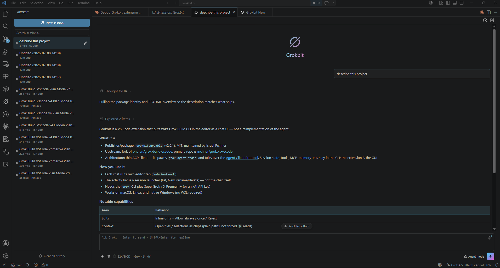
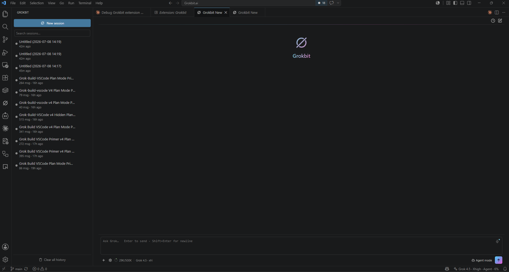
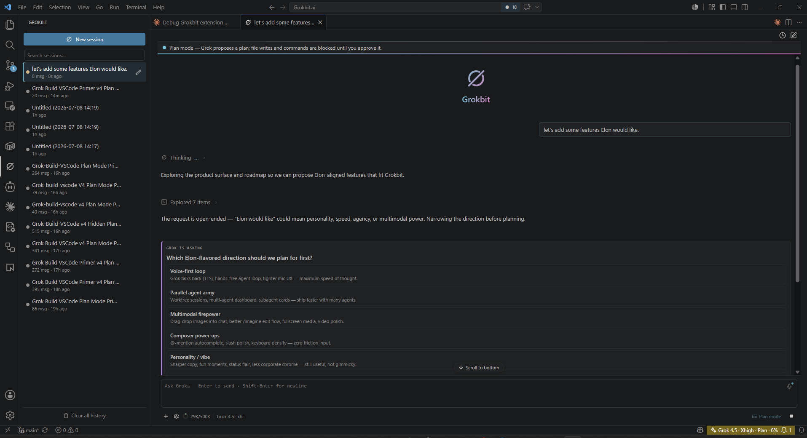
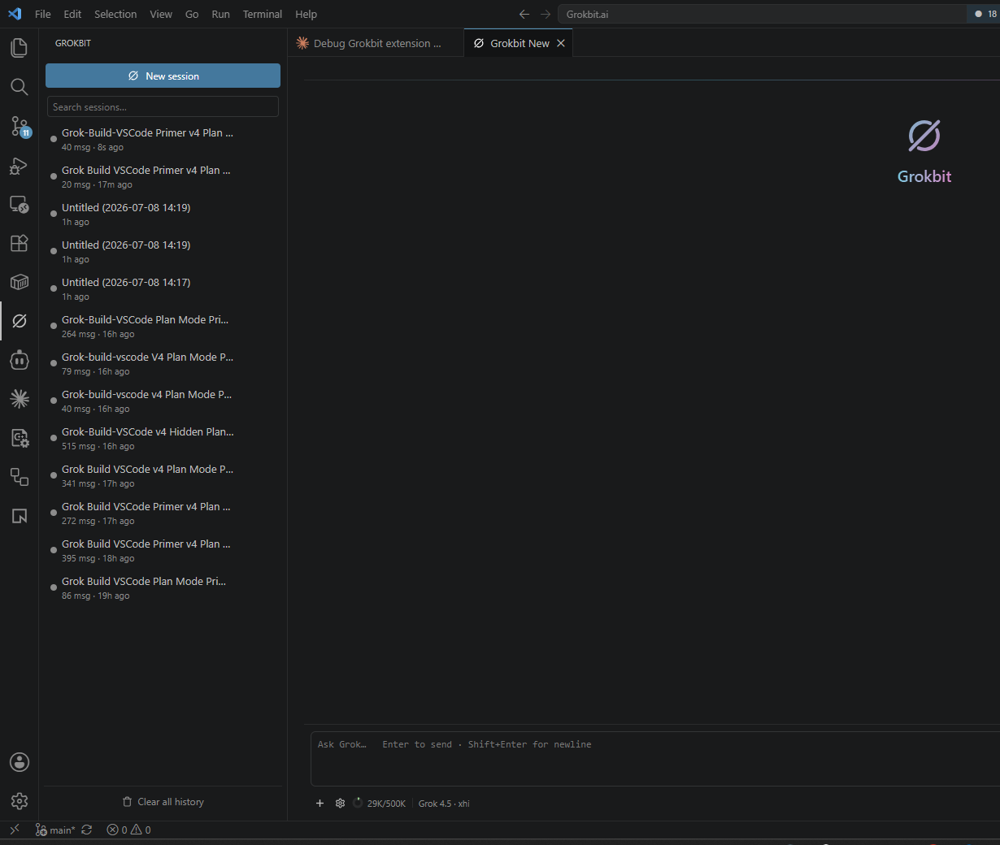
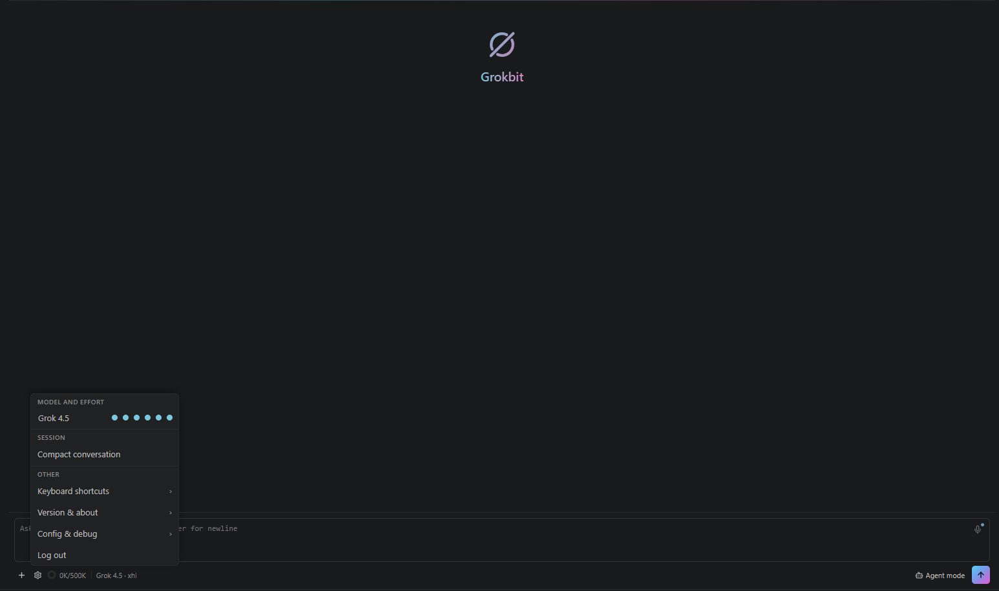

# Grokbit

[](LICENSE) [](https://code.visualstudio.com) [](#)

> A VS Code UI for **xAI's Grok Build CLI** — not affiliated with or endorsed by xAI. *Grok*, *Grok Build*, and *xAI* are trademarks of xAI; this project uses those names only to describe what it's compatible with.
>
> Based on [phuryn/grok-build-vscode](https://github.com/phuryn/grok-build-vscode) by Paweł Huryn, MIT License.

**Grokbit** is the friendly editor UI for Grok Build — ask questions, plan changes safely, review edits before they land, generate images & video, and dictate by voice. **Each chat is its own editor tab.** You do not need to use a terminal day to day.

Install the free `grok` CLI once, sign in (subscription or API key), and Grokbit is the GUI on top.

**Install free from the [VS Code Marketplace](https://marketplace.visualstudio.com/items?itemName=grokbit.grokbit) or [Open VSX Registry](https://open-vsx.org/extension/grokbit/grokbit)**



---

## Who this is for

- **Prefer a GUI over the terminal** — chat, approve changes, and manage history without memorizing CLI commands.
- **Want a safety net** — Plan first mode, permission cards, and inline diffs so you always see what will change.
- **Work in VS Code / Cursor / similar** — Grok sits next to your files, not in a separate app.

Engineers can still use the CLI; this extension does not remove power features — it wraps them in plain language.

---

## Requirements

- **VS Code** 1.94+ (or a compatible editor — Cursor, Windsurf, VSCodium).
- **The Grok Build CLI** (`grok`) on macOS, Linux, or Windows. A native Windows build is supported — no WSL required (WSL2 + Remote-WSL still works if you prefer it).
- **A login:** either a **SuperGrok or X Premium+** subscription (`grok /login`) or an xAI API key. Subscription unlocks **Grok Build**; an API key can also unlock additional models and **grok-imagine**. (Grok's free tier does **not** include the CLI agent.)
- **For voice control only** (optional): [`ffmpeg`](https://ffmpeg.org) on `PATH`, and a *separate* xAI API key for Speech-to-Text (pay-as-you-go — your CLI login does **not** cover it). See [Voice control](#voice-control).

---

## Install

**1. Install the CLI and sign in.**

macOS / Linux / WSL:

```bash
curl -fsSL https://x.ai/cli/install.sh | bash
grok /login
```

Windows (PowerShell):

```powershell
irm https://x.ai/cli/install.ps1 | iex
grok /login
```

`grok /login` opens a browser and completes sign-in in one step. Prefer an API key? Get one at [console.x.ai](https://console.x.ai) and set `XAI_API_KEY` in your shell or a workspace `.env` (the extension auto-loads it).

**2. Install the extension.**

From the Marketplace — search **Grokbit**, or:

```bash
code --install-extension grokbit.grokbit
```

Or build from source:

```bash
git clone https://github.com/irichner/grokbit-vscode.git
cd grokbit-vscode
npm install
npm run rebuild             # bump → package → reinstall → publish to Marketplace
# same as: ./scripts/install.sh  |  Windows: pwsh scripts\install.ps1
# local only: npm run rebuild -- --no-publish
# needs VSCE_PAT (Marketplace Manage) or: npx @vscode/vsce login Grokbit
# in a Grok chat: /rebuild
```

Reload VS Code (**Ctrl+Shift+P → Developer: Reload Window**) and click the Grok icon in the activity bar.

> **Tip:** Right-click the Grok icon → **Move To → Secondary Side Bar** to park Grok on the right, next to other AI tools.

**Uninstall:** `./scripts/uninstall.sh` (Windows: `pwsh scripts\uninstall.ps1`) or `code --uninstall-extension grokbit.grokbit`.

---

## Quick start

1. **Open** Grokbit (activity bar icon, or `Ctrl/Cmd+;`). The **launcher** lists sessions; **New session** opens a chat tab.
2. **Type your first message.** The welcome screen's **Session setup** card lets you pick agent, model, thinking depth, and mode before you start — changing them on a fresh tab is free.
3. **Press Enter** to send. Grok streams an answer. While it works you may see *Thinking…* (turn on full thinking details in the gear menu if you want them).
4. **Approve actions.** When Grok wants to edit a file or run a command, a **permission card** appears — review the **inline diff**, then *Allow this change*, *Allow always*, or *Don't allow*.
5. **Choose a mode** (Agent / Plan first / Auto accept), **model**, and **thinking depth** from the bottom toolbar and gear menu.
6. **Come back later** — history and launcher list past chats for this project so you can resume anytime.

---

## Features & capabilities

_Click any feature to expand._

<details>
<summary><strong>Native session tabs + activity-bar launcher</strong></summary>

Each chat lives in its **own editor tab** (like a document). The left activity bar is a **launcher**: recent sessions (up to 7), status dots, rename/delete, and **New session**. Full history and search live in the chat tab’s history popover. You can keep several chats open and switch between them like any other tabs.

A tab uses the **whole editor canvas** by default — no centred column, no width setting. Cards and capability rows flow into more columns as the tab gets wider; the transcript, composer, and code blocks are always full-bleed. The one exception is agent reply text, which keeps a left-aligned ~95-character reading measure so long paragraphs stay legible without narrowing anything else.

Closing a tab stops that chat’s live process but keeps history on disk (unless it was an empty “new session” you never used). After a VS Code reload, tabs can restore; the visible tab reconnects first.

The small line above **New session** reads e.g. `v3.0.4 · 1.0B tokens`. That is **not your usage** — it is what building Grokbit itself has cost, aggregated across every maintainer and every session, baked into the build and identical for everyone (hover for the exact number and the date it was measured). Your own session's context lives in the composer donut and the status-bar percentage.



</details>

<details>
<summary><strong>Session setup card</strong> — pick agent, model, thinking, and mode up front</summary>

A new empty session shows a short value prop and a **Session setup** card: **Agent** (Grok / Claude Code), **Model**, **Thinking** depth, and **Mode** (Agent / Plan first / Auto accept). A brand-new tab has no history, so changing any of them there is free and invisible — nothing to restart, nothing to lose. The same four controls stay available mid-session from the model chip in the composer toolbar.

</details>

<details>
<summary><strong>Grokbit Actions</strong> — a built-in workflow, plus everything your agent can already do</summary>

**Grokbit Actions** is on the welcome canvas of every new session, and any time from the **Grokbit Actions** button in the top bar or "Browse Grokbit Actions…" beside the composer's **+** button.

It leads with the **Grokbit workflow** — four skills that ship with the extension and work identically on Grok and Claude Code:

| | |
|---|---|
| `/grokbit-plan` | Turn a vague request into a grounded, reviewed plan — every claim read from the repo, every task with a command that proves it worked. |
| `/grokbit-implement` | Work the plan one task at a time. Each task passes its check or is reverted; there is no half-finished state. |
| `/grokbit-test` | Record how things behaved *before* the change, then prove what did and didn't change afterward. |
| `/grokbit-document` | Write the README, changelog, runbook or spec — then actually run every command in it. |

Below that sits everything the selected CLI already had — your own **skills**, **agents/subagents**, and its built-in **slash commands** (including model-only skills the slash menu hides). Every row leads with a plain name and description, not a slash token; the `/command` form (and an argument hint, when the CLI has one) shows beside it as a small chip, so you learn the shortcut by seeing it. Every row is a real, discovered capability, never an invented prompt suggestion:

- Click an invocable command or skill to seed the composer (e.g. `/grokbit-plan `) — nothing is sent until you press Enter.
- Click a non-invocable skill or agent to open its source file.
- A built-in agent type with no source file (e.g. grok's `general-purpose`/`explore`/`plan`) is informational only.

The workflow skills are installed into `~/.grok/skills` and `~/.claude/skills` when the extension starts, and refreshed when it updates — which is what lets the CLI actually run them. Because that is a per-user install, they also show up in Grok and Claude Code sessions you start outside VS Code. Set **`grok.skills.provision`** to `off` to manage your own skills instead, or **`grok.showCapabilities`** to `false` to hide the browser entirely.

</details>

<details>
<summary><strong>Business Studio (3.0)</strong> — tasks + docs browser</summary>

Thin-client Studio surfaces (not a separate Office app, not five permanent sidebar tabs):

- **Docs** (chat top bar) — browse a capped list of business documents already in the workspace; open, reveal in the OS, attach as context, or seed a path into the composer.

When a turn produces a document path, a **document card** still offers Copy path / Open / Reveal. Generation still uses Grok CLI skills (`/docx`, `/pptx`, `/xlsx`, …) and ordinary file tools — ask in plain language or use slash skills from autocomplete. This is not a built-in Office suite.

</details>

<details>
<summary><strong>Modes — Agent, Plan first & Auto accept</strong></summary>

| Mode | In plain English |
|---|---|
| **Agent** (default) | Grok can help right away. It **may ask** before editing files or running commands. |
| **Plan first** | Grok drafts a plan first. **Nothing changes** in your project until you approve the plan. |
| **Auto accept** | Grok acts **without asking** for permission on each change. Use when you trust the session. |

Your last non-plan mode (Agent or Auto accept) is remembered for **new** sessions. Plan first is always a deliberate choice for the task at hand.



</details>

<details>
<summary><strong>Permission cards with inline diff</strong> — see every edit before you approve</summary>

When Grok proposes an edit, the **diff is shown inside the chat card** — green additions, red deletions, long unchanged stretches collapsed. Buttons use plain language:

- **Allow this change** — approve once
- **Allow always** — approve this kind of action for the rest of the session (when the CLI offers it)
- **Don't allow** — reject

The file is written only **after** you approve. Past edits stay reviewable via **view diff** on the tool row. Diffs never open a separate editor tab (so focus stays on chat).

</details>

<details>
<summary><strong>Questions from Grok</strong></summary>

Sometimes Grok needs a choice from you (multiple options). An **inline question card** appears; pick an option (and Submit if there are several questions). After you answer, the card collapses to a green “✓ your choice” summary. On resume, past answers replay as read-only cards.

</details>

<details>
<summary><strong>File context chips</strong> — point Grok at the right files</summary>

- The **active editor** can be included automatically as context (setting: `grok.includeActiveFileByDefault`).
- **Drag** files from the Explorer, right-click → **Grokbit: Send File**, press **Alt+G**, or use the **+** button to attach files.
- Explicit attachments are stronger than the ambient “currently open” file.
- Hold **Shift** while dragging to embed file contents as a fenced block instead of a path reference.

</details>

<details>
<summary><strong>Session history — resume, rename, delete, clear all</strong></summary>

The **clock** icon (and the launcher) lists this project’s sessions, newest first:

- Click a row to **resume** (conversation, images, plans, and tools replay).
- Hover to **rename** or **delete**.
- **Search** filters by name across your whole history.
- The list loads **100 at a time** and loads more as you scroll (stays fast with thousands of sessions).
- **Clear all history** removes every session for this project **except** ones that still have an open tab.



</details>

<details>
<summary><strong>Status dots</strong> — see which chats need you</summary>

| Dot | Meaning |
|---|---|
| 🔵 Blue | Working on it |
| 🟡 Yellow | Needs your OK (permission, question, or plan) |
| 🟢 Green | Finished — not opened yet |
| 🔴 Red | Finished with an error — not opened yet |
| ⚪ Gray | At rest / already seen |

Unread green/red badges persist across reloads until you open that session.

</details>

<details>
<summary><strong>Status-bar HUD + optional notifications</strong></summary>

A native **status bar** item (bottom of VS Code) mirrors the active chat: model, thinking depth, mode, context %, working spinner, and a **bell** count when any session needs you. Click it to jump back to chat.

Optional setting **`grok.notifyWhenWaiting`** (off by default): a passive notification when a **background** tab needs you — it never steals focus; you choose *Go to session*.

</details>

<details>
<summary><strong>Image & video generation</strong> — <code>/imagine</code> in chat</summary>

Type `/imagine <description>` (or `/imagine-video <description>`) and results render **inline** in the chat. Hover for **Copy path** / **Open in VS Code**. Subscription-only Grok features; they survive session resume. Editing a reference photo with `/imagine` is supported when the CLI offers it.

</details>

<details>
<summary><strong id="voice-control">Voice control</strong> — speak instead of type</summary>

The **microphone** in the composer records speech via [xAI Speech-to-Text](https://docs.x.ai/developers/model-capabilities/audio/voice). Words appear live as you talk. Say your send phrase (default **“grok send”**) to submit hands-free.

**Needs:** `ffmpeg` on PATH + a separate API key (`grok.voiceApiKey` or env). **Cost:** pay-as-you-go STT (~$0.10/hr batch, ~$0.20/hr streaming) — not covered by SuperGrok alone. Details: [research/voice-input.md](research/voice-input.md).

</details>

<details>
<summary><strong>Tool activity</strong> — what Grok did, in plain language</summary>

While Grok works, each turn's activity rolls into **one compact carousel strip** instead of a scrolling list: the strip shows the current action (*Reading chat.js…*, *Running command…*) with a step counter, and **‹ ›** flips back through earlier steps. When the turn finishes it collapses to a one-line summary — e.g. *Explored 5 items, edited 2 files · 9 steps* — that expands to the full detail (tool rows, step narration, thinking). Commands can show **output**, failed tools turn red with a short reason, and a **files changed** strip above the composer summarizes applied edits this turn. Prefer the classic scrolling stream? Turn off `grok.compactActivity` (gear → **Config & debug → Compact activity view**).

</details>

<details>
<summary><strong>Model & thinking depth</strong></summary>

Pick the **model** and **reasoning effort** (none → xhigh) from the gear menu or the small model chip in the toolbar. Effort is how deeply Grok “thinks” (more depth = more tokens/time). Changing effort restarts the session (optional summarize-and-restart). Some model switches restart when the CLI requires a different agent type — the extension handles that.



</details>

<details>
<summary><strong>Show / hide thinking & chat size</strong></summary>

- **`grok.showThinking`** (default off) — when off, a short *Thinking…* stand-in is shown instead of full reasoning traces. Toggle live under gear → **Config & debug → Show thinking details**.
- **`grok.chatFontScale`** — zoom only the Grok chat (60–300%), not the whole editor.

</details>

<details>
<summary><strong>Math, diagrams & markdown</strong></summary>

- **LaTeX** math renders via MathJax (offline). Hover a display equation to copy or export PNG/SVG.
- **Mermaid** diagrams render inline (offline, theme-aware). Hover to copy source or export.
- Normal markdown (code, lists, tables) is fully supported.


</details>

<details>
<summary><strong>Slash commands</strong></summary>

Type `/` in the composer for autocomplete from your installed CLI (e.g. `/imagine`, `/compact`, …). Snapshot: [docs/SLASH-COMMANDS.md](docs/SLASH-COMMANDS.md).

</details>

<details>
<summary><strong>Cost awareness</strong></summary>

The **context donut** shows how full the conversation window is. Use **`/compact`** (gear → Compact) to compress history, or start a **new session**. Lower **thinking depth** for cheaper/faster turns.

</details>

<details>
<summary><strong>MCP tools</strong></summary>

Extra tools (browser automation, etc.) are configured in the **CLI** (`~/.grok/config.toml` or project `.grok/config.toml`). Gear → **Connected tools (MCP)** / open config files, then start a new session to reload.

</details>

<details>
<summary><strong>Sign out</strong></summary>

Gear → **Log out**, or command **Grokbit: Log Out** — runs `grok logout`, closes live session tabs, and shows the signed-out launcher. History stays on disk; sign in again to resume.

</details>

<details>
<summary><strong>Telemetry (opt-out)</strong></summary>

Anonymous usage only: one `session_start` per real conversation with install id + mode/model/effort — **never** message content, code, or paths. Off with `grok.telemetry.enabled: false` or VS Code’s global telemetry setting. See [docs/privacy.md](docs/privacy.md).

</details>

---

## Configuration

<details>
<summary><strong>All <code>grok.*</code> settings</strong> (VS Code Settings → search "Grokbit" or "grok")</summary>

| Setting | Default | Notes |
|---|---|---|
| `grok.cliPath` | `""` | Path to the `grok` binary. Empty = auto-discover. |
| `grok.defaultModel` | `""` | Model ID for new sessions. Empty = CLI default. |
| `grok.defaultEffort` | `""` | Thinking depth (`none` / `minimal` / `low` / `medium` / `high` / `xhigh`). Changing it restarts the session. |
| `grok.defaultMode` | `""` | Mode for new sessions: Agent or Auto accept (Plan first is never remembered). Empty = Agent. |
| `grok.includeActiveFileByDefault` | `true` | Auto-add the active editor as a context chip. |
| `grok.useCtrlEnterToSend` | `false` | When true, Enter inserts a newline and Ctrl/Cmd+Enter sends. |
| `grok.showThinking` | `false` | Show full thinking details in chat. |
| `grok.compactActivity` | `true` | Roll each turn's activity into one carousel strip (off = classic scrolling stream). |
| `grok.showCapabilities` | `true` | Show Grokbit Actions (the bundled workflow plus your own skills, agents, commands) on the welcome canvas and the top-bar button. |
| `grok.skills.provision` | `auto` | Install the bundled Grokbit workflow skills into `~/.grok/skills` and `~/.claude/skills` so the CLIs can run them. `off` to manage your skills yourself. |
| `grok.notifyWhenWaiting` | `false` | Passive notification when a background tab needs you. |
| `grok.telemetry.enabled` | `true` | Anonymous usage telemetry (see Privacy). |
| `grok.chatFontScale` | `100` | Chat-only zoom percent (60–300). |
| `grok.voiceApiKey` | `""` | xAI API key for voice STT (separate from CLI login). |
| `grok.ffmpegPath` | `""` | Path to `ffmpeg`. Empty = PATH. |
| `grok.voiceInputDevice` | `""` | Microphone override. Empty = system default. |
| `grok.voiceSendPhrase` | `"grok send"` | Spoken phrase to auto-submit. Empty = disable. |
| `grok.voiceStreaming` | `true` | Live streaming STT (`false` = cheaper batch). |

</details>

---

## Commands & keyboard shortcuts

<details>
<summary><strong>VS Code commands & keys</strong> (Ctrl/Cmd+Shift+P → "Grokbit")</summary>

| Command | What it does |
|---|---|
| `Grokbit: Open` | Open the Grokbit launcher / focus chat |
| `Grokbit: New Session` | Start a fresh session tab |
| `Grokbit: Compact Conversation` | Compress conversation context |
| `Grokbit: Pick Model` | Open the model picker |
| `Grokbit: Toggle Plan / Agent Mode` | Open the mode picker |
| `Grokbit: Send File` | Attach the selected file as context |
| `Grokbit: Send Selection` | Send the current text selection |
| `Grokbit: Insert @-Mention` | Attach the active file from the editor |
| `Grokbit: Show Logs` | Open troubleshooting logs |
| `Grokbit: Log Out` | Sign out of the Grok CLI |

| Key | Action |
|---|---|
| `Ctrl+;` / `Cmd+;` | Open Grokbit |
| `Alt+G` | Attach the current file (when the editor is focused) |
| `Enter` | Send message (default) |
| `Shift+Enter` | New line (default) |
| `Ctrl/Cmd+Enter` | Send, if you enabled “Ctrl+Enter to send” |

Also listed in-app: gear → **Keyboard shortcuts**.

</details>

---

## How it works

The extension is intentionally **thin**: it talks to `grok agent stdio` and renders the results. Grok owns sessions, memory, tools, and models; Grokbit mediates file access, terminals, permissions, and the UI.

**Plan first** is the one place the extension adds a safety layer: it blocks workspace writes and non-read-only commands until you approve a plan, using clear follow-up messages Grok understands.

Full architecture notes: **[docs/architecture.md](docs/architecture.md)**.

---

## Development

<details>
<summary><strong>Build, test & repo conventions</strong></summary>

```bash
npm install
npm test         # grok-free unit/DOM/integration suite — same as CI
npm run package  # → grokbit-<version>.vsix
```

`npm test` never spawns the real `grok` binary. A separate `npm run test:live` exercises the real CLI before releases. See **[TESTS.md](TESTS.md)** and **[docs/architecture.md](docs/architecture.md)**.

</details>

---

## Known limits

- **Diff preview** compares proposed old vs new text (not necessarily disk at preview time); the write happens after you approve.
- **No worktree UI** yet.
- **Subagent inspector** is not shipped (the CLI does not expose nested subagent cards over ACP in current builds).
- The launcher defaults to the **left** activity bar; move it to the secondary side bar manually if you want it on the right.

---

## Privacy

**Privacy by design** — no message content, no code, no file paths, and no account identity leave your machine via telemetry. Turn telemetry off anytime with `grok.telemetry.enabled: false` or VS Code's global telemetry setting.

More: [docs/privacy.md](docs/privacy.md).

---

## License & attribution

Licensed under the **MIT License** — see [LICENSE](LICENSE). MIT is permissive (use, modify, sell, even in closed-source products) but **not** obligation-free: the copyright notice and license text must travel with **all copies, including compiled builds**. If you're reusing this project, see [docs/attribution.md](docs/attribution.md) for what that means and how to credit it properly.
